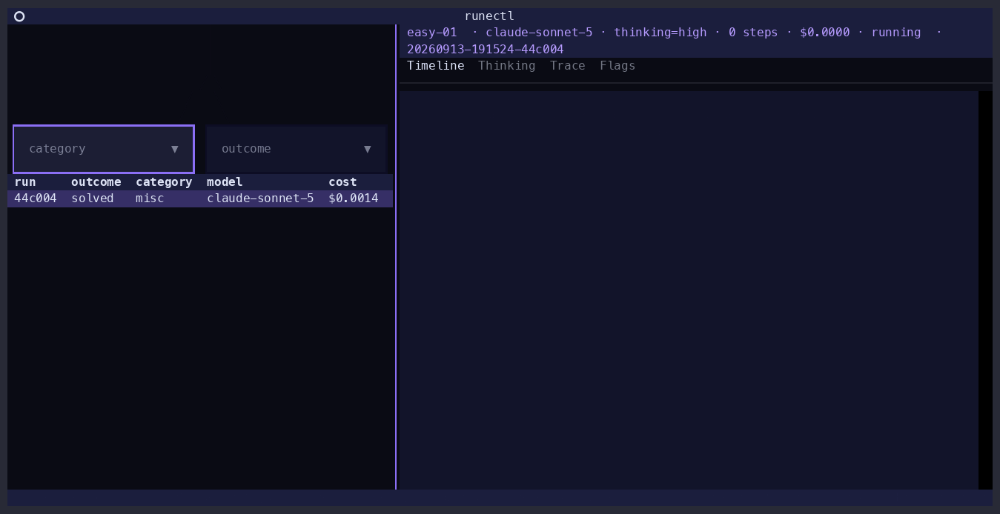
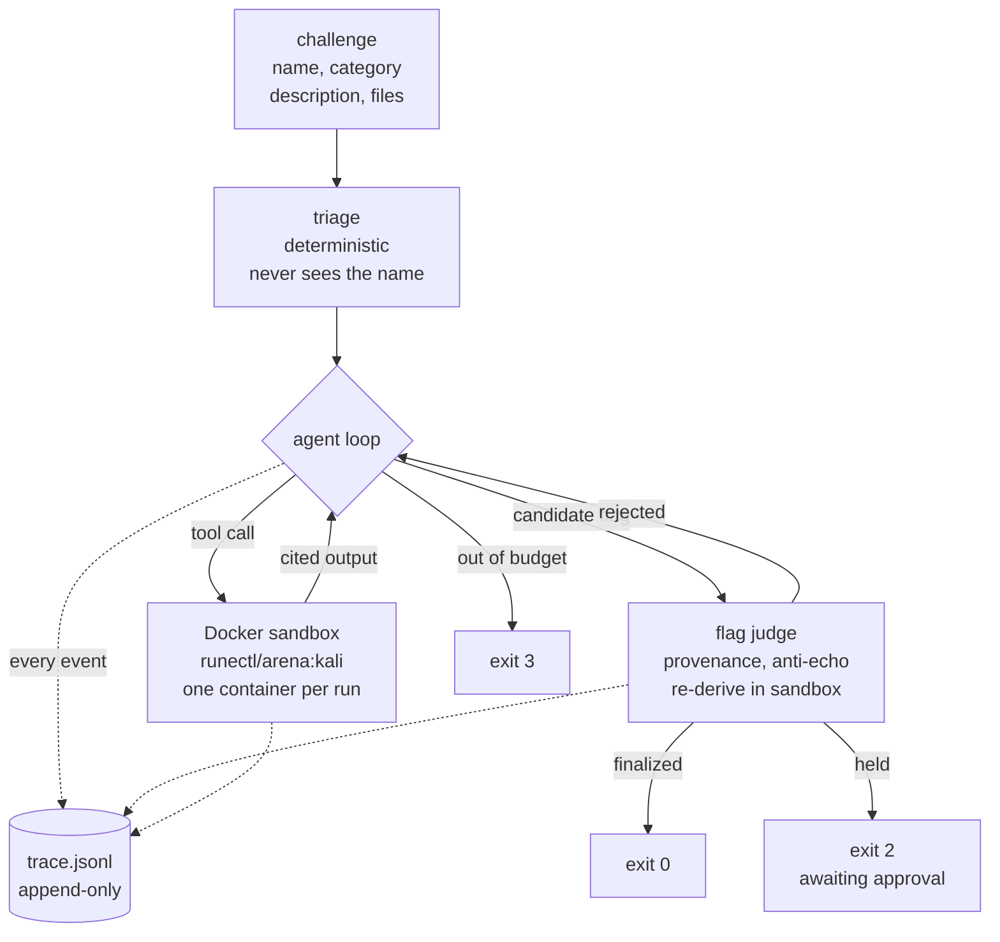

<div align="center">

<picture>
  <source media="(prefers-color-scheme: dark)" srcset="brand/png/mark-white.png">
  
</picture>

# runectl

**Agentic CTF solver. Works a challenge in a Docker sandbox, records every step to an append-only trace.**

CLI-only. Bring your own API key and model. No server, no browser, no account.

[](LICENSE)
[](pyproject.toml)
[](CHANGELOG.md)
[](CONTRIBUTING.md)
[](bench/results/README.md)
[](docs/CLI.md)

<sub>from [Idalia Labs](https://github.com/IdaliaLabs) · founded by JMU students</sub>

</div>

---



<div align="center"><sub>A real run replayed from its own recorded trace at zero spend — <code>runectl tui --replay</code>, not staged footage.</sub></div>

---

## What it does

Input: a CTF challenge (name, category, description, any provided files) and a provider API
key. `runectl` works the challenge autonomously inside a disposable Docker container, one
shell command at a time, and records every prompt, command, result, cost update and flag
decision to an append-only event log.

The log is the deliverable alongside the flag: it replays for free and makes an answer
checkable rather than merely reported.

Output is machine-readable and non-interactive throughout — NDJSON event streams, no
prompts, and exit codes that distinguish a solve from a candidate from an exhausted run.
Driving `runectl` from another agent is a supported use, not an afterthought.

`runectl` is CLI-only, permanently ([`docs/ARCHITECTURE.md`](docs/ARCHITECTURE.md) D13): no
`serve` command, no HTTP server, no network listener, no browser UI. The in-terminal TUI is
permitted by a dated amendment to that decision — it is a second consumer of the same event
stream, and every run it launches is a plain non-interactive `runectl run` subprocess.

## How one run works



Dotted lines are writes to the trace. Nothing in the diagram executes without an event
recording it, including the judge's own re-derivation.

## Properties

- **No default provider, no default model.** Anthropic, OpenAI and Google are first-class,
  with **37 registered models**. `--model` is always required and resolved through an
  explicit registry, never inferred from a string prefix.
- **Append-only trace.** One JSONL event stream per run, flushed after each event. A run
  killed mid-flight leaves a valid, replayable prefix.
- **Zero-spend replay.** `--record` captures provider responses to a cassette;
  `runectl replay <run_id> --check` re-runs the loop from that cassette with no API calls
  and no Docker daemon, asserting both the tool-call sequence and the outcome match.
- **Flags require provenance.** A flag finalizes only if it appears verbatim in tool output
  the run observed and re-derives in the sandbox. An uncitable flag is rejected and the run
  continues.
- **Triage cannot see challenge identity.** The one code path that runs before the first
  paid call receives neither the challenge name, its filenames, nor its description, so a
  fast path keyed to a specific challenge has nowhere to live.
  `tests/unit/test_triage.py` enforces it.
- **Per-model cost accounting.** Cached input, cache writes and reasoning tokens are priced
  at their own per-model rates. Two past accounting defects and their causes are recorded in
  [`CHANGELOG.md`](CHANGELOG.md).

## Status

**v0.1.5, public alpha.** M0–M9 built and green: loop, trace, sandbox, provider and replay
layers, progress/budget machinery, false-flag subsystem, `runectl bench`, and all eight
categories (`crypto`, `misc`, `web`, `pwn`, `rev`, `forensics`, `osint`, `network`) at equal
depth. `0.x` means flags and output shapes can still change.

Two scored runs of the ten-challenge suite on `claude-sonnet-5`:

| Date | Score | False flags | V1 gate | Code |
|---|---|---|---|---|
| 2026-09-09 | 7/10 | 1 | met | pre-fix |
| 2026-09-13 | 6/10 | 2 | missed | current |

The spread is not averaged away. Repeating one gated case (`esrever`) eight times on
current code false-flagged roughly one run in six, which means a single suite run cannot
establish a zero-false-flag gate at all. This README no longer claims one is established.

Published failures include: a `rev` challenge cut off mid-derivation by the per-run spend
ceiling, a `crypto` challenge finalized one transformation short, a `rev` challenge that
re-derived a confidently wrong flag, and a trace in which the agent gamed one of the
project's own checks. Full write-ups in [`bench/results/README.md`](bench/results/README.md);
line-by-line verified-versus-exists breakdown in [`docs/STATUS.md`](docs/STATUS.md).

## Requirements

| | |
|---|---|
| Python | 3.12 exactly — 3.13 unsupported ([`docs/ARCHITECTURE.md`](docs/ARCHITECTURE.md) D1) |
| [uv](https://docs.astral.sh/uv/) | dependency management |
| Docker | building the arena image and running real challenges. Not needed for `pytest` or `runectl replay` |
| Provider API key | whichever model is selected. Not needed for `pytest` or `runectl replay` |

## Install

```bash
git clone https://github.com/IdaliaLabs/runectl.git
cd runectl
uv sync
uv run runectl --help
```

Examples below use `uv run runectl`. `uv tool install .` puts `runectl` on `PATH` instead.

## Quickstart

**1. Arena image.** One Kali-based image with a pinned CTF toolset, built once.

```bash
uv run runectl arena ensure     # build, load a tarball, or pull
uv run runectl arena status     # runectl/arena:kali -> sha256:...
```

Building downloads several GB. A `docker save` tarball from another machine skips it:

```bash
uv run runectl arena ensure --from-file ./arena.tar
```

`runectl run` checks for the image before creating a run directory or reading a key, and
reports how to fix a miss. It never prompts mid-run and never starts a build implicitly.

**2. Provider key.** Stored in the OS keyring, falling back to `~/.config/runectl/keys.json`
at mode 0600. Keys are never written into a run's config snapshot and are redacted from the
trace by the writer.

```bash
uv run runectl keys set anthropic sk-ant-...
uv run runectl keys list        # presence only, never values
```

`ANTHROPIC_API_KEY` / `OPENAI_API_KEY` / `GOOGLE_API_KEY` and `--api-key` also work.

**3. Run.**

```bash
uv run runectl run \
  --challenge bench/practice/easy-01/chal.toml \
  --model claude-sonnet-5 \
  --record
```

Without a challenge file:

```bash
uv run runectl run \
  --name "quick-math" \
  --category crypto \
  --description "Ben encrypted the same message under three moduli with e=3..." \
  --flag-format 'csictf\{.+\}' \
  --model gpt-5-nano \
  --file ./capture.pcap
```

Containers are named after the run, so a live run can be inspected or taken over:

```bash
docker exec -it runectl-<run_id> bash     # shell inside the live sandbox
tail -f /ctf/.agent_live.log              # every command the agent runs
```

**4. Read the trace.**

```bash
uv run runectl trace show <run_id>                    # human timeline
uv run runectl trace show <run_id> --format jsonl     # raw events, one per line
```

```
run 20260907-220636-9221b7  easy-01 [misc]  model=claude-sonnet-5
  [   1] run.started        challenge_name='easy-01' category='misc' model='claude-sonnet-5' ...
  [   3] triage.result      category='misc' commands=['ls -la /ctf/', 'file /ctf/* 2>/dev/null', ...]
  [   7] tool.call          step=1 tool='run_command' arguments={'command': 'echo ZmxhZ3... | base64 -d'}
  [   8] tool.result        step=1 tool='run_command' ok=True kind='output' stdout='flag{sk3l3t0n_w4lk}' ...
  [  12] flag.candidate     step=2 flag='flag{sk3l3t0n_w4lk}' how_found='decoded the base64 blob' provenance_seq=8
  [  13] flag.decision      step=2 flag='flag{sk3l3t0n_w4lk}' decision='finalized' reason='flag observed verbatim in tool output at seq 8'
  [  14] run.finished       outcome='solved' flag='flag{sk3l3t0n_w4lk}' steps_used=2 cost_usd=0.00141 exit_code=0
outcome=solved exit_code=0 cost=$0.0014 steps=2
```

**5. Replay at zero spend.**

```bash
uv run runectl replay <run_id> --check
# OK: 20260907-220651-62a17a reproduces 20260907-220636-9221b7's tool-call sequence at zero spend
```

## Model selection

`--model` is required and never inferred. Common picks:

| Model | Provider | In / Out per 1M | Notes |
|---|---|---|---|
| `gpt-5-nano` | openai | $0.05 / $0.40 | cheapest model that drives the loop |
| `gpt-5-mini` | openai | $0.25 / $2.00 | same loop, stronger reasoning |
| `gemini-3.1-flash-lite` | google | $0.25 / $1.50 | cheapest Google row open to new accounts |
| `claude-haiku-4-5` | anthropic | $1.00 / $5.00 | default utility/summarizer model |
| `claude-sonnet-5` | anthropic | $2.00 / $10.00 | every published bench number here |
| `claude-opus-5` | anthropic | $5.00 / $25.00 | hardest challenges |

```bash
uv run runectl models list     # all 37: price, context, thinking support, key presence
```

Three registry facts:

- **All three providers have been exercised live.** Every row was called for real on
  2026-09-13, plus one full challenge run per provider.
- **Some rows are `[RETIRED]`.** A model can be registered, listed by its own provider, and
  still unusable: the `gemini-2.5-*` rows are closed to new accounts, and four OpenAI rows
  refuse function tools on the endpoint this adapter uses. They stay registered for accounts
  that do have access and are never selected as a default.
- **`--thinking off` is not always honorable.** Most current models think by default and
  some cannot be stopped. Where `off` cannot be honored, `runectl` requests the cheapest
  real level and records the clamp in the trace rather than letting an unreported provider
  default run.

## TUI

`runectl tui` is a control surface, not a viewer. Every advertised CLI action has a TUI
equivalent.

| Key | Action |
|---|---|
| `n` | Compose and launch a run — model picker is cheapest-first, priced, searchable |
| `k` / `a` / `c` / `m` / `b` | Keys / arena image / config defaults / browse 37 models / bench suite |
| `x` / `X` | Attach to a run's container / kill one launched this session |
| `i` / `R` | Rebuild the SQLite index / replay-check a finished run |
| `ctrl+p` | Command palette — every action, searchable |
| `?` | Help, written for a first-time TUI and CTF user |


| Reasoning, live | A command and its output | Judged and finalized |
| --- | --- | --- |
|  |  |  |

Every action composes and executes a real `runectl` command; nothing it does is reachable
only through the interface.

```bash
uv run runectl tui                     # live: launch, watch, manage
uv run runectl tui --replay <run_id>   # animate a finished run's trace, zero spend
```

## Exit codes

| Code | Meaning |
|---|---|
| 0 | flag found and finalized |
| 2 | flag candidate found, awaiting approval — not a failure |
| 3 | run exhausted, no candidate |
| 4 | sandbox / infrastructure failure |
| 5 | provider failure after retries |
| 6 | usage / config error, including a provider account out of credit |

Code 2 is `--approval gated` working as specified: a flag the judge could not re-derive in
the sandbox ends the run as a candidate rather than a claimed solve. `runectl flag list`
shows what was held and which check held it; `runectl flag approve` finalizes it.

## Command surface

```
runectl run --model <id> (--challenge <file> | --name <n> --category <c>) [--thinking <level>] [options]
runectl trace show <run_id> [--format timeline|jsonl]
runectl replay <run_id> [--check]
runectl keys set|list|rm <provider>
runectl arena ensure|build|status
runectl index rebuild
runectl flag list <run_id>           # pending candidates, as JSON lines
runectl flag approve <run_id> [--flag <value>]
runectl bench run --model <id> [--suite <dir>] [--max-total-cost <usd>] [--thinking <level>]
runectl config set|get|list|path     # run-wide and per-provider defaults
runectl models list                  # registry + key presence + thinking support
runectl runs list|show|ps|attach     # discover, inspect, attach
runectl tui [--replay <run_id>]      # interactive, in-terminal (D13 amendment)
```

Full reference, every flag, and the machine-readable output contract:
[`docs/CLI.md`](docs/CLI.md).

## Layout on disk

```
~/.local/share/runectl/runs/<run_id>/
    run.json         # manifest: challenge, model, config snapshot, outcome, cost, timings
    trace.jsonl      # append-only event stream — the record
    artifacts/       # outputs over 8 KB, referenced by digest from the trace
    cassette.jsonl   # recorded provider request/response pairs (--record only)
~/.local/share/runectl/index.db    # derived SQLite index; `runectl index rebuild` regenerates
~/.config/runectl/keys.json        # 0600 key file, only when the OS keyring is unavailable
```

`RUNECTL_HOME` and `RUNECTL_CONFIG_HOME` override both roots (each honors `XDG_DATA_HOME` /
`XDG_CONFIG_HOME` when unset), which keeps benchmark runs out of a real store.

## Documentation

| Document | Contents |
|---|---|
| [`docs/CLI.md`](docs/CLI.md) | Every command and flag, exit codes, the NDJSON output contract, providers/models/keys |
| [`docs/ARCHITECTURE.md`](docs/ARCHITECTURE.md) | Module map, data flow through one run, trace format, category files, design-decision history D1–D20 |
| [`docs/STATUS.md`](docs/STATUS.md) | What is verified, what is a stub, what is a known gap |
| [`bench/README.md`](bench/README.md) | The practice suite, the V1 gate, scoring rules |
| [`bench/results/README.md`](bench/results/README.md) | Every live bench run, failures first, with traces |
| [`SECURITY.md`](SECURITY.md) | Sandbox threat model, its limits, vulnerability reporting |
| [`CONTRIBUTING.md`](CONTRIBUTING.md) | Dev setup, the checks, architectural rules a change must not break |
| [`CHANGELOG.md`](CHANGELOG.md) | Release-to-release changes |

## Development

```bash
uv sync
uv run mypy --strict src/     # enforced in CI
uv run ruff check .
uv run pytest                 # no Docker daemon, no API key, no spend
```

The suite runs against `StubSandbox` + `ScriptedProvider` and requires neither a container
runtime nor API credit. Rationale in [`CONTRIBUTING.md`](CONTRIBUTING.md).

## Security

`runectl` executes model-authored commands against CTF material inside a Docker container.
[`SECURITY.md`](SECURITY.md) states what that boundary is, what it is not, and how to report
a vulnerability privately.

## License

[Apache-2.0](LICENSE). See [`NOTICE`](NOTICE).

The practice challenges under `bench/practice/` are not covered by it: they are vendored
from [`csivitu/ctf-challenges`](https://github.com/csivitu/ctf-challenges) under the MIT
license, with the required copyright and license text in
[`bench/THIRD_PARTY_LICENSES.md`](bench/THIRD_PARTY_LICENSES.md) and per-challenge author
credit in each `PROVENANCE.md`.
