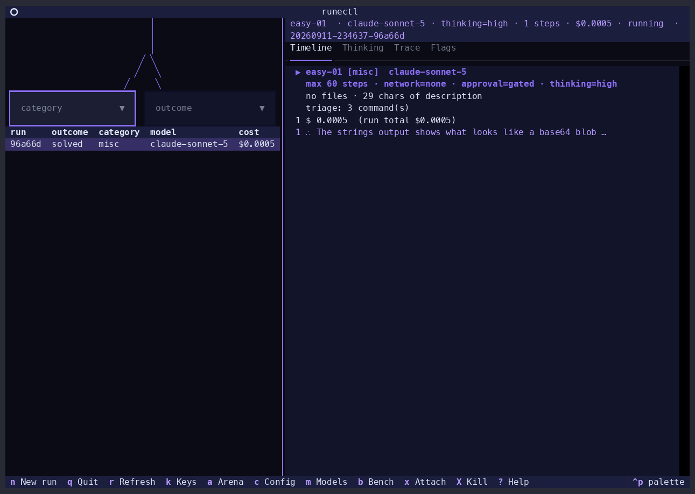
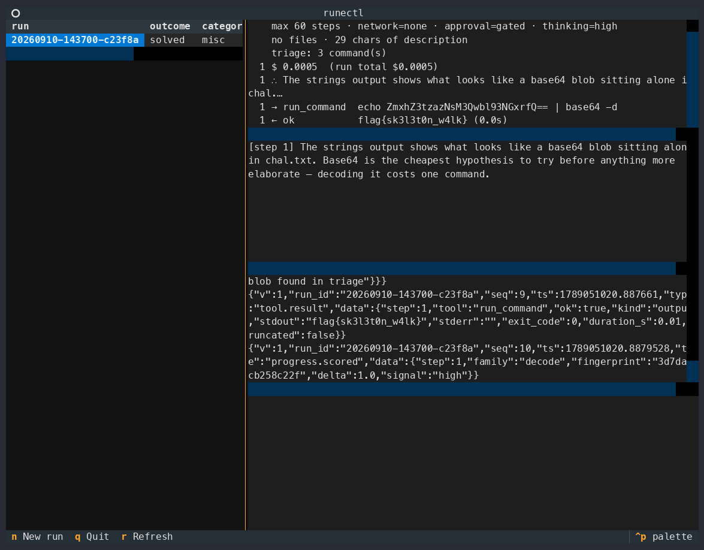
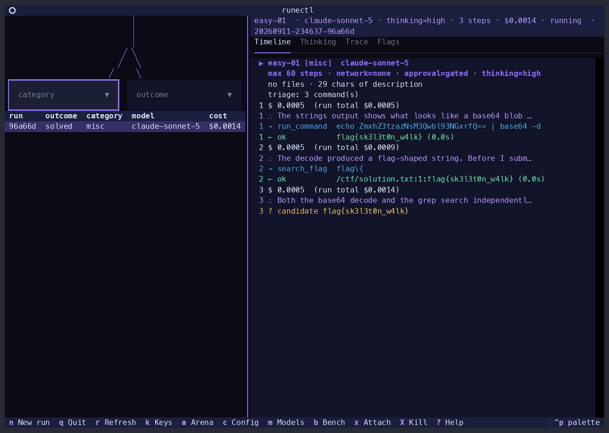
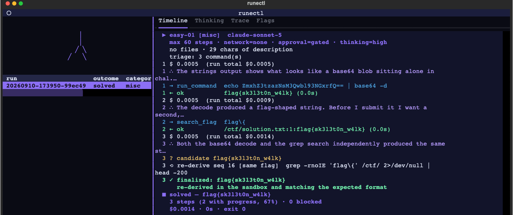

<picture>
  <source media="(prefers-color-scheme: dark)" srcset="brand/png/mark-white.png">
  
</picture>

# runectl

[](LICENSE)
[](pyproject.toml)
[](CHANGELOG.md)

An agentic CTF solver CLI, from [Idalia Labs](https://github.com/IdaliaLabs).

## What it is

You hand `runectl` a CTF challenge — its name, category, the description you were given,
any provided files — plus your own AI provider API key (Anthropic, OpenAI, or Google;
whichever model you want). It works the challenge autonomously inside a disposable Docker
sandbox, one shell command at a time, and writes down everything it tried so the result is
checkable afterward, not just trusted. It's a CLI, not a service — no account, no server,
nothing running anywhere but your own machine — and it's built to be driven by another AI
agent as easily as by a person: machine-readable output, nothing interactive, exit codes
that tell the truth about how a run ended.

**No server, no browser UI, ever** — `runectl` is CLI-only, permanently
([`docs/ARCHITECTURE.md`](docs/ARCHITECTURE.md) D13). A local, in-terminal TUI
(`runectl tui`) is in bounds as of a dated 2026-09-09 amendment to D13; it's a second
consumer of the same event stream, never a network surface, and every run it launches is
still a plain non-interactive `runectl run` subprocess.

---

## See it solve one

Every frame below is a real, replayable run — the fixture `make demo` also plays back
live in your terminal (`runectl tui --replay`), not staged footage. Full walkthrough:
[`docs/demo/runectl-demo.mp4`](docs/demo/runectl-demo.mp4).

| Reasoning, live | A command and its output | Judged and finalized |
| --- | --- | --- |
|  |  |  |

## Why it's good

- **Bring your own key, bring your own model.** Anthropic, OpenAI, and Google are all
  first-class, with no default provider and no default model — `--model` is always
  required, looked up in an explicit registry, never guessed from a string prefix.
  Different models are genuinely better at different categories; that choice stays yours.
- **Every solve is checkable.** Each run writes an append-only JSONL event stream — every
  prompt, tool call, command result, cost update and flag decision, flushed to disk after
  each event. A run killed mid-flight still leaves a valid, replayable prefix.
- **Replay at zero spend.** `--record` captures provider responses to a cassette;
  `runectl replay <run_id> --check` re-runs the whole loop from that cassette with no
  API calls and no Docker daemon, asserting the tool-call sequence *and the outcome* are
  identical to the original.
- **It refuses to invent a flag.** A submitted flag is only finalized if it appears
  verbatim in tool output the run actually observed and is re-derivable in the sandbox.
  A flag the agent can't point to in its own trace is rejected and the run keeps going.
- **No answer keys, structurally.** The one code path that runs before the first paid
  call — deterministic triage — never receives the challenge name, its filenames, or its
  description, so a fast-path keyed to a specific file has nowhere to live. A test
  enforces it.

> **Status: v0.1.0, first public alpha.** M0–M9 are built and green: the loop, trace,
> sandbox, provider and replay layers, the progress/budget machinery, the false-flag
> subsystem, `runectl bench`, and **all eight categories** — `crypto`, `misc`, `web`,
> `pwn`, `rev`, `forensics`, `osint` and `network`, at equal depth. It has been scored on
> live challenges and those numbers are published in full: the latest run
> (2026-09-09, claude-sonnet-5, ten-challenge suite) scored **7 of 10 solved with 1 false
> flag, and the V1 gate met — 6 solved, 0 false over the 7 gated cases**
> ([`bench/results/README.md`](bench/results/README.md)). The write-ups lead with the
> failures — a `rev` challenge the per-run spend ceiling cut off mid-derivation, a
> `crypto` challenge finalized one transformation short, and a trace where the agent
> gamed one of our own checks. Read [`docs/STATUS.md`](docs/STATUS.md) for the
> line-by-line breakdown of what's verified versus what merely exists before you rely on
> anything here. `0.x` means the CLI's flags and output shape can still change before
> `1.0` — see [`CHANGELOG.md`](CHANGELOG.md).

## Requirements

- **Python 3.12** (3.13 is not supported yet — see [`docs/ARCHITECTURE.md`](docs/ARCHITECTURE.md) D1)
- **[uv](https://docs.astral.sh/uv/)** for dependency management
- **Docker** — needed to build the arena image and to run real challenges. Not needed
  for the test suite or for `runectl replay`.
- **A provider API key** for whichever model you choose. Not needed for the test suite
  or for `runectl replay`.

## Install

```bash
git clone https://github.com/IdaliaLabs/runectl.git
cd runectl
uv sync
uv run runectl --help
```

Every example below uses `uv run runectl`. If you'd rather have `runectl` on your PATH
directly, `uv tool install .` also works.

## Quickstart

**1. Set up the sandbox image.** One Kali-based image with a pinned CTF toolset, built
once. `ensure` walks you through it the first time.

```bash
uv run runectl arena ensure     # asks: build it, load a file you have, or pull one
uv run runectl arena status     # runectl/arena:kali -> sha256:...
```

Building takes a while and downloads several GB. If you already have the image as a
`docker save` tarball — from another machine, or for an offline competition — skip the
build entirely:

```bash
uv run runectl arena ensure --from-file ./arena.tar
```

`runectl run` checks for this image before it creates a run directory or touches your API
key, and tells you exactly how to fix it if it's missing. It never prompts mid-run and
never silently starts a 30-minute build.

**2. Store a provider key.** It goes into your OS keyring, falling back to
`~/.config/runectl/keys.json` at mode 0600. Keys are never written into a run's config
and are redacted from the trace by the writer itself.

```bash
uv run runectl keys set anthropic sk-ant-...
uv run runectl keys list        # presence only, never values
```

`ANTHROPIC_API_KEY` / `OPENAI_API_KEY` / `GOOGLE_API_KEY` work too, as does `--api-key`.

**3. Solve something.**

```bash
uv run runectl run \
  --challenge bench/practice/easy-01/chal.toml \
  --model claude-sonnet-5 \
  --record
```

Or without a challenge file:

```bash
uv run runectl run \
  --name "quick-math" \
  --category crypto \
  --description "Ben encrypted the same message under three moduli with e=3..." \
  --flag-format 'csictf\{.+\}' \
  --model gpt-5 \
  --file ./capture.pcap
```

While it runs, you can take over — containers are named after the run:

```bash
docker exec -it runectl-<run_id> bash     # a shell inside the live sandbox
tail -f /ctf/.agent_live.log              # or just watch every command it runs
```

**4. Read the trace.**

```bash
uv run runectl trace show <run_id>                    # human timeline
uv run runectl trace show <run_id> --format jsonl     # raw events, one per line
```

```
run 20260907-220636-9221b7  easy-01 [misc]  model=claude-sonnet-5
  [   1] run.started        challenge_name='easy-01' category='misc' model='claude-sonnet-5' ...
  [   3] triage.result      category='misc' commands=['ls -la /ctf/', 'file /ctf/* 2>/dev/null', ...]
  [   7] tool.call          step=1 tool='run_command' arguments={'command': 'echo ZmxhZ3... | base64 -d'}
  [   8] tool.result        step=1 tool='run_command' ok=True kind='output' stdout='flag{sk3l3t0n_w4lk}' ...
  [  12] flag.candidate     step=2 flag='flag{sk3l3t0n_w4lk}' how_found='decoded the base64 blob' provenance_seq=8
  [  13] flag.decision      step=2 flag='flag{sk3l3t0n_w4lk}' decision='finalized' reason='flag observed verbatim in tool output at seq 8'
  [  14] run.finished       outcome='solved' flag='flag{sk3l3t0n_w4lk}' steps_used=2 cost_usd=0.00141 exit_code=0
outcome=solved exit_code=0 cost=$0.0014 steps=2
```

**5. Replay it, free.**

```bash
uv run runectl replay <run_id> --check
# OK: 20260907-220651-62a17a reproduces 20260907-220636-9221b7's tool-call sequence at zero spend
```

## The TUI

`runectl tui` is the interactive way to watch a run, or several, without leaving your
terminal — the same event stream `trace show` reads, live, with pending flags one
keypress from approval. It composes and shows you the exact `runectl run` command before
launching anything; nothing about what it does is hidden behind the interface.



```bash
uv run runectl tui                     # live: launch and watch runs, approve flags
uv run runectl tui --replay <run_id>   # animate through a finished run's trace, zero spend
```

Press `?` inside it for a plain-English rundown of what everything does — built for
someone who's never used a TUI or played a CTF before, not just for people who already
know what a "trace" is.

## Exit codes

`runectl run` never lies about how a run ended. This is what makes it safe to script.

| code | meaning |
|---|---|
| 0 | flag found and finalized |
| 2 | flag candidate found, awaiting approval — *not* a failure |
| 3 | run exhausted, no candidate |
| 4 | sandbox / infrastructure failure |
| 5 | provider failure after retries |
| 6 | usage / config error |

Code 2 is the default policy working as intended, not an error: under `--approval gated`
a flag the judge could not re-derive in the sandbox ends the run as a *candidate* rather
than a claimed solve. `runectl flag list` shows what was held and which check held it;
`runectl flag approve` finalizes it. See [`docs/STATUS.md`](docs/STATUS.md).

## Command surface

```
runectl run --model <id> (--challenge <file> | --name <n> --category <c>) [--thinking <level>] [options]
runectl trace show <run_id> [--format timeline|jsonl]
runectl replay <run_id> [--check]
runectl keys set|list|rm <provider>
runectl arena ensure|build|status
runectl index rebuild
runectl flag list <run_id>           # pending candidates, as JSON lines
runectl flag approve <run_id> [--flag <value>]
runectl bench run --model <id> [--suite <dir>] [--max-total-cost <usd>] [--thinking <level>]
runectl config set|get|list|path     # per-provider preferences (model, thinking)
runectl models list                  # registry + key presence + thinking support
runectl runs list|show|ps|attach     # discover, inspect, and attach to runs
runectl tui [--replay <run_id>]      # interactive, in-terminal view (D13 amendment)
```

Full reference, every flag, and the machine-readable output contract:
[`docs/CLI.md`](docs/CLI.md).

## Where things live

```
~/.local/share/runectl/runs/<run_id>/
    run.json         # manifest: challenge, model, config snapshot, outcome, cost, timings
    trace.jsonl      # append-only event stream — THE record
    artifacts/       # spilled outputs over 8 KB, referenced by digest from the trace
    cassette.jsonl   # recorded provider request/response pairs (only with --record)
~/.local/share/runectl/index.db    # derived SQLite index; `runectl index rebuild` regenerates it
~/.config/runectl/keys.json        # 0600 key file, only if the OS keyring is unavailable
```

Override with `RUNECTL_HOME` and `RUNECTL_CONFIG_HOME` (both honor `XDG_DATA_HOME` /
`XDG_CONFIG_HOME` when unset). Handy for keeping benchmark runs out of your real store.

## Documentation

| Document | What's in it |
|---|---|
| [`docs/CLI.md`](docs/CLI.md) | Every command and flag, exit codes, the NDJSON output contract, providers/models/keys |
| [`docs/ARCHITECTURE.md`](docs/ARCHITECTURE.md) | Module map, how data moves through one run, the trace format, category files, and the full design-decision history (D1–D20) — read before changing anything structural |
| [`docs/STATUS.md`](docs/STATUS.md) | What is real, what is a stub, what is a known gap |
| [`bench/README.md`](bench/README.md) | The practice suite, the V1 gate, and how a case is scored |
| [`bench/results/README.md`](bench/results/README.md) | Every live bench run, failures first, with the traces |
| [`SECURITY.md`](SECURITY.md) | The sandbox threat model, what Docker is *not* protecting you from, reporting |
| [`CONTRIBUTING.md`](CONTRIBUTING.md) | Dev setup, the checks, and the architectural rules a PR must not break |
| [`CHANGELOG.md`](CHANGELOG.md) | What changed release to release |

## Development

```bash
uv sync
uv run mypy --strict src/     # strict typing is enforced in CI
uv run ruff check .
uv run pytest                 # no Docker daemon, no API key, no spend
```

The whole test suite runs against `StubSandbox` + `ScriptedProvider`, so it needs
neither a container runtime nor a cent of API credit. That's deliberate — see
[`CONTRIBUTING.md`](CONTRIBUTING.md).

## Security

`runectl` runs model-authored commands against CTF material inside a Docker container.
[`SECURITY.md`](SECURITY.md) states what that boundary is and — more importantly — what
it is not, plus how to report a vulnerability privately.

## License

[Apache-2.0](LICENSE). See [`NOTICE`](NOTICE).

The practice challenges under `bench/practice/` are **not** covered by it: they are
vendored from [`csivitu/ctf-challenges`](https://github.com/csivitu/ctf-challenges) under
the MIT license, with the required copyright and license text in
[`bench/THIRD_PARTY_LICENSES.md`](bench/THIRD_PARTY_LICENSES.md) and per-challenge author
credit in each `PROVENANCE.md`.
